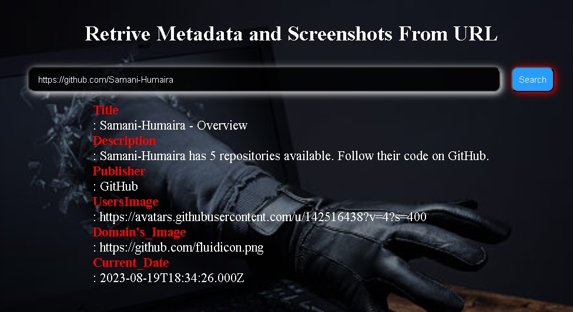

# Web App for Fetching Data from Pasted URLs

Welcome to the **Web App for Fetching Data from Pasted URLs** readme! This web application is designed to make it easy to retrieve various types of data, such as photos, descriptions, and favicon icons, from URLs that you paste into the app. Whether you're a developer looking to extract data for a project or simply a user interested in gathering information from different websites, this app has got you covered.

## Table of Contents

- [Features](#features)
- [Getting Started](#getting-started)
  - [Prerequisites](#prerequisites)
  - [Installation](#installation)
- [Supported Data](#supported-data)
- [Contributing](#contributing)

## Features

- **URL Data Extraction:** Easily paste URLs into the app to fetch data such as photos, descriptions, and favicon icons from websites.
- **User-Friendly Interface:** The app provides a clean and intuitive interface that makes the data extraction process simple and efficient.
- **Multiple Data Types:** Retrieve various types of data in one go, saving you time and effort.
- **Quick and Lightweight:** The app is designed to work swiftly without unnecessary bloat, ensuring a seamless user experience.

## Getting Started

### Prerequisites

Before you begin, ensure you have the following:

- Modern web browser (Chrome, Firefox, Safari, etc.)

### Installation

The **Web App for Fetching Data from Pasted URLs** 
- Clone the repository or download the ZIP file and extract it to your desired directory.
- Open a terminal or command prompt.
- Navigate to the project directory using the cd command:

## Supported Data

The **Web App for Fetching Data from Pasted URLs** currently supports the extraction of the following types of data:

- Photos/Images: High-resolution images found on the provided URL.
- Descriptions: Meta descriptions or brief textual summaries of the content.
- Favicon Icons: The small icons that appear in the browser's tab or address bar.

## Contributing

If you'd like to contribute to the development of this web app, please follow these steps:

1. Fork the repository and clone it to your local machine.
2. Create a new branch for your feature/bug fix.
3. Make your changes and test thoroughly.
4. Submit a pull request, detailing your changes and improvements.

---

Thank you for using the **Web App for Fetching Data from Pasted URLs**! If you encounter any issues or have suggestions for improvements, please don't hesitate to . 